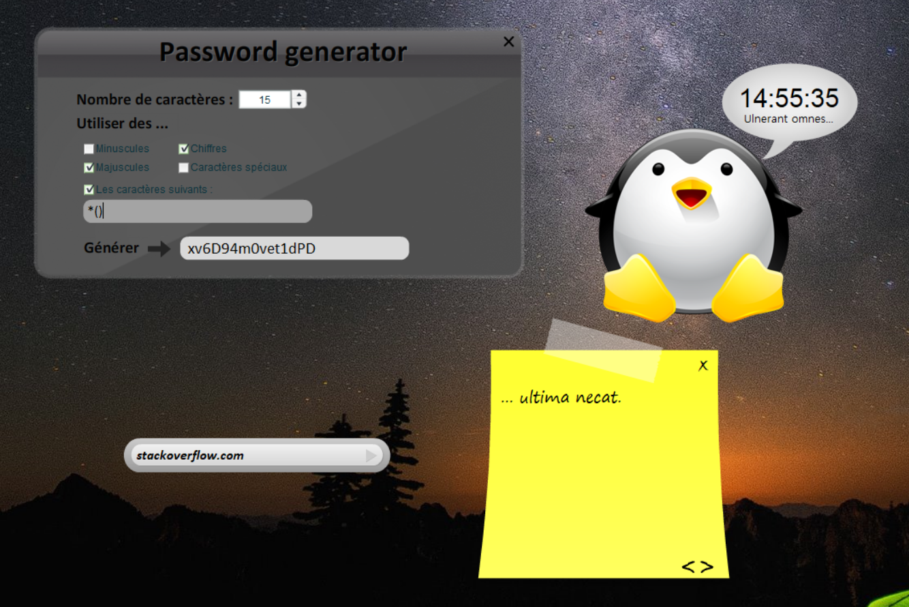

``# Desktop Widgets

Nostalgia upload of one of my first real projects, in the Macromedia Flash 8 days.
Four widgets written in ActionScript, extended with the swf2exe converter `mProjector`.

- A configurable password generator
- A persistable, multi-page notepad
- A small URL launchbar
- A tux-themed desktop clock

*Tux mascot courtesy of crystalxp.net, other "assets" mine.*
